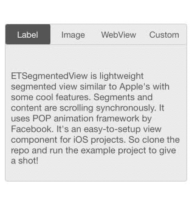

ETSegmentedView is a lightweight and synchronous custom segmented view for iOS platform. It's an easy-to-setup and fully customizable component.

[](http://cocoapods.org/pods/ETSegmentedView)
[](http://cocoapods.org/pods/ETSegmentedView)
[](http://cocoapods.org/pods/ETSegmentedView)



##Dependencies
ETSegmentedView depends on the [POP](https://github.com/facebook/pop) animation framework by facebook.

## Using [CocoaPods](http://cocoapods.org/)

ETSegmentedView is available through [CocoaPods](http://cocoapods.org). To install
it, simply add the following line to your Podfile:

```ruby
pod "ETSegmentedView"
```

And run `pod install`

## Manually from Github
1. Download source files from [subdirectory](https://github.com/ersentekin/ETSegmentedView/tree/master/Pod/Classes)
2. Add the source files to your Xcode project.
3. Import the `ETSegmentedView.h` header file. 

## Usage

To run the example project, clone the repo, and run  from the Example directory first.

Here's the sample code to add ETSegmentedView to your any UIViewController or UIView

###1. Initialize and customize the view
```objectivec
ETSegmentedView* sv = [[ETSegmentedView alloc] 
	initWithFrame:CGRectMake(10, 60, [[UIScreen mainScreen] bounds].size.width - 20, 260)];
sv.nonSelectionColor = [UIColor whiteColor];
sv.selectionColor = [UIColor darkGrayColor];
```

###2. Set titles
```objectivec
[sv setTitles:@[@"Label", @"Image", @"WebView", @"Custom"]];
```

###3. Set contents
```objectivec
UILabel* label = [[UILabel alloc] initWithFrame:CGRectMake(0, 0, 70, 40)];

UIImageView* imageView = [UIImageView alloc] initWithImage:[UIImage imageNamed:@"photo.png"];

// you can access segmentedView's button container view height with : "sv.viewButtons"
UIWebView* webView = [[UIWebView alloc] initWithFrame:CGRectMake(0, 0, sv.frame.size.width, sv.frame.size.height - sv.viewButtons.frame.size.height)];

UIView* customView = [[UIView alloc] initWithFrame:CGRectMake(0, 0, 100, 50)];

[arrayContents addObjectsFromArray:@[label, imageView, webView, customView]];
[sv setContents:arrayContents];

// if you are adding component to UIViewController
[self.view addSubview:sv];
```
###Cheers! 🍻

## License

ETSegmentedView is available under the MIT license. See the [LICENSE file](https://github.com/ersentekin/ETSegmentedView/blob/master/LICENSE) for more info.
